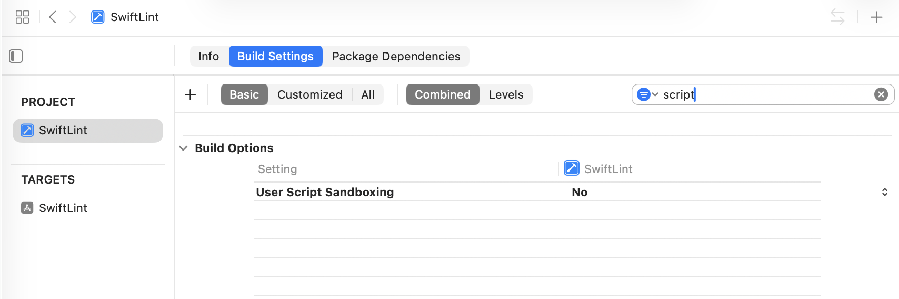
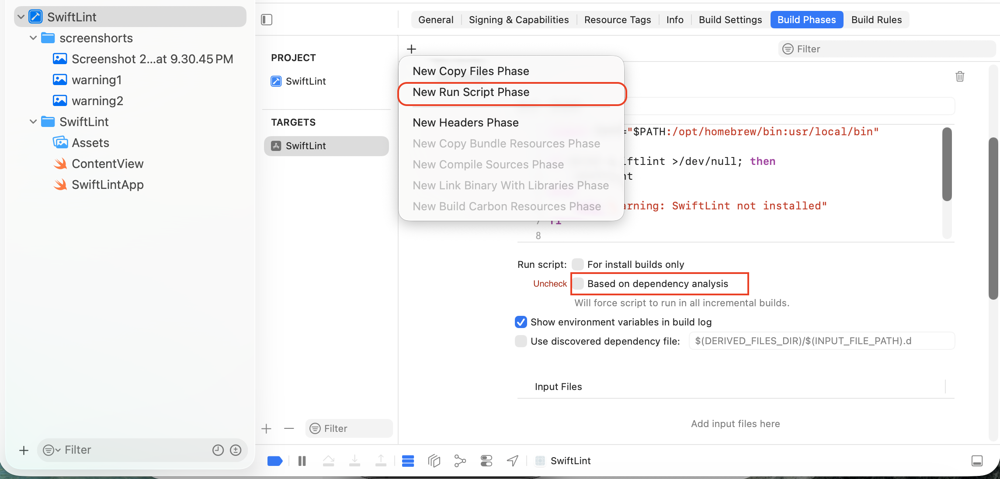
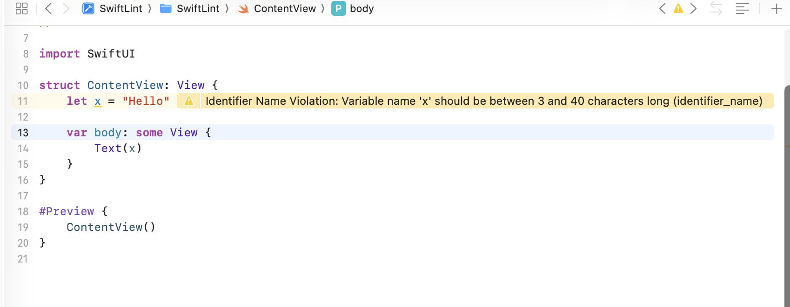
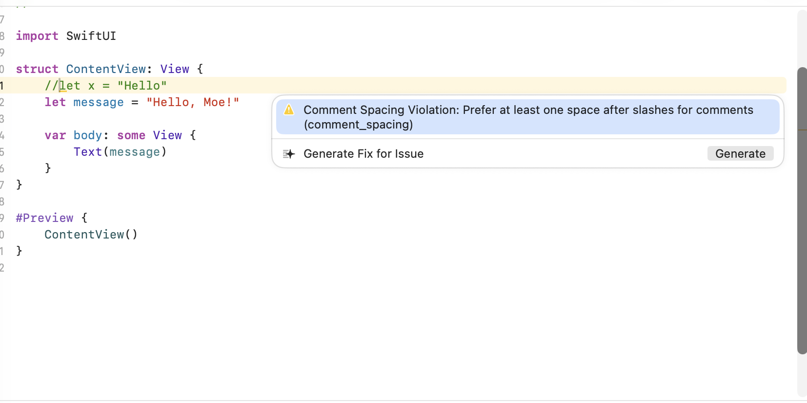
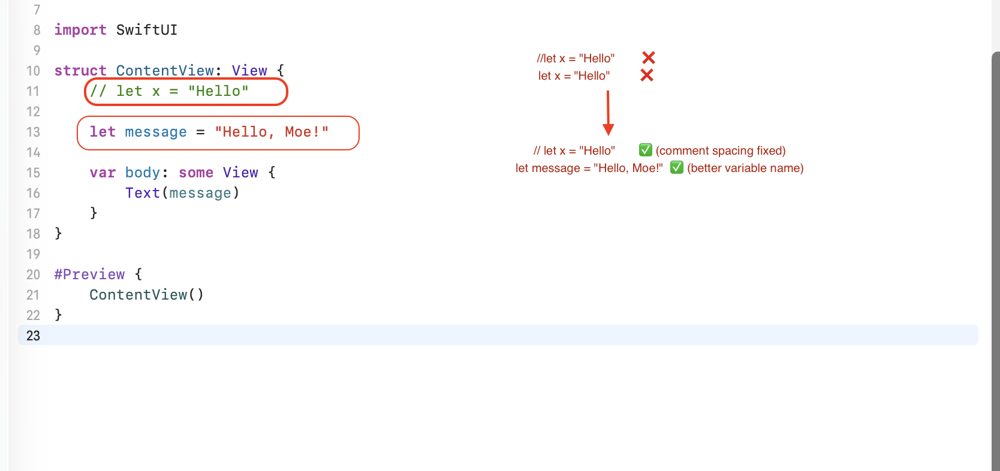

# 📱 SwiftLint Practice Project

## 1️⃣ About SwiftLint

SwiftLint is a static analysis tool for Swift.  
It checks Swift code and warns developers when the code does not follow style rules.

SwiftLint helps keep code:
- Clean
- Consistent
- Easy to read
- Professional

---

## 2️⃣ Why We Use SwiftLint

We use SwiftLint because it helps developers catch style issues early.

SwiftLint is useful because it:
- Enforces Swift coding standards
- Improves code readability
- Helps teams write consistent code
- Finds simple mistakes before code review
- Supports custom rules using a `.swiftlint.yml` file

---

## 3️⃣ Project Structure

```text
SwiftLint/
├── screenshots/
│   ├── 1.swiftlint_build_settings.png
│   ├── 2.swiftlint_run_script_setup.png
│   ├── 3.swiftlint_identifier_warning.png
│   ├── 4.swiftlint_comment_spacing_warning.png
│   └── 5.swiftlint_comment_and_identifier_fixed.png
├── SwiftLint/
│   ├── Assets
│   ├── ContentView.swift
│   └── SwiftLintApp.swift
├── SwiftLint.xcodeproj
├── .swiftlint.yml
└── README.md
```

---

## 4️⃣ Setup Steps

### Step 1: Install SwiftLint

```bash
brew install swiftlint
```

Check the installed version:

```bash
swiftlint version
```

---

### Step 2: Add Run Script in Xcode

Go to:

```text
Target → Build Phases → + → New Run Script Phase
```

Add this script:

```bash
export PATH="$PATH:/opt/homebrew/bin:usr/local/bin"

if which swiftlint >/dev/null; then
    swiftlint
else
    echo "warning: SwiftLint not installed"
fi
```

This script tells Xcode to run SwiftLint every time the project builds.

---

### Step 3: Create `.swiftlint.yml`

Create a `.swiftlint.yml` file in the same folder as `SwiftLint.xcodeproj`.

```yaml
# Disable specific SwiftLint rules
disabled_rules:
  - trailing_whitespace  # Ignores extra spaces at the end of a line

# Set line length limits
line_length:
  warning: 120   # Shows a warning when a line is longer than 120 characters
  error: 200     # Shows an error when a line is longer than 200 characters

# Set variable and identifier naming rules
identifier_name:
  min_length: 3  # Variable names must be at least 3 characters long
```

---

## 5️⃣ Explanation of `.swiftlint.yml`

### `disabled_rules`

```yaml
disabled_rules:
  - trailing_whitespace
```

This disables the `trailing_whitespace` rule.  
That means SwiftLint will not warn if there are extra spaces at the end of a line.

---

### `line_length`

```yaml
line_length:
  warning: 120
  error: 200
```

This checks whether a line is too long.

- More than 120 characters → warning
- More than 200 characters → error

---

### `identifier_name`

```yaml
identifier_name:
  min_length: 3
```

This checks variable names.

Variable names must have at least 3 characters.

Example:

```swift
let x = "Hello"        // Warning
let message = "Hello"  // Correct
```

---

## 6️⃣ Practice Examples Covering All YAML Rules

### Practice 1: Test `identifier_name`

This rule checks short variable names.

#### Bad Code

```swift
let x = "Hello"
```

SwiftLint warning:

```text
Identifier Name Violation: Variable name 'x' should be between 3 and 40 characters long
```

#### Fixed Code

```swift
let message = "Hello, Moe!"
```

Explanation:  
The variable name `x` is too short.  
The name `message` is better because it is clear and has more than 3 characters.

---

### Practice 2: Test `comment_spacing`

This rule checks comment spacing.

#### Bad Code

```swift
//let x = "Hello"
```

SwiftLint warning:

```text
Comment Spacing Violation: Prefer at least one space after slashes for comments
```

#### Fixed Code

```swift
// let x = "Hello"
```

Explanation:  
SwiftLint expects one space after `//`.

---

### Practice 3: Test `line_length`

This rule checks long lines.

#### Bad Code

```swift
let longMessage = "This is a very long message that is intentionally written to pass the warning line length limit so SwiftLint can detect it during practice."
```

SwiftLint warning:

```text
Line Length Violation
```

#### Fixed Code

```swift
let longMessage = """
This is a long message, but it is written using a multiline string
so the code is easier to read and follows the line length rule.
"""
```

Explanation:  
Long lines are harder to read.  
Breaking long text into multiple lines makes the code cleaner.

---

### Practice 4: Test `trailing_whitespace`

This rule is disabled in this project.

#### Example

```swift
let message = "Hello, Moe!"    
```

There may be extra spaces after the code, but SwiftLint will not warn because this rule is disabled:

```yaml
disabled_rules:
  - trailing_whitespace
```

Explanation:  
This practice confirms that disabled rules are ignored by SwiftLint.

---

## 7️⃣ Practice Code for `ContentView.swift`

Use this code to practice SwiftLint warnings:

```swift
import SwiftUI

struct ContentView: View {
    //let x = "Hello"
    let x = "Hello"

    let longMessage = "This is a very long message that is intentionally written to pass the warning line length limit so SwiftLint can detect it during practice."

    var body: some View {
        VStack {
            Text(x)
            Text(longMessage)
        }
    }
}

#Preview {
    ContentView()
}
```

This code should create warnings for:
- Comment spacing
- Identifier name
- Line length

---

## 8️⃣ Fixed Code for `ContentView.swift`

After fixing the warnings, the code should look like this:

```swift
import SwiftUI

struct ContentView: View {
    // let oldMessage = "Hello"
    let message = "Hello, Moe!"

    let longMessage = """
    This is a long message, but it is written using a multiline string
    so the code is easier to read and follows the line length rule.
    """

    var body: some View {
        VStack {
            Text(message)
            Text(longMessage)
        }
    }
}

#Preview {
    ContentView()
}
```

---

## 9️⃣ Screenshots

### 1. Build Settings


---

### 2. Run Script Setup


---

### 3. Identifier Warning


---

### 4. Comment Spacing Warning


---

### 5. Fixed Comment and Identifier



## 🔟 Useful Commands

Run SwiftLint manually:

```bash
swiftlint
```

Auto-fix some issues:

```bash
swiftlint --fix
```

Check SwiftLint version:

```bash
swiftlint version
```

---

## 🎯 Conclusion

This project demonstrates how to:
- Install SwiftLint
- Add SwiftLint to Xcode
- Create and explain a `.swiftlint.yml` file
- Practice each YAML rule
- Fix SwiftLint warnings in Swift code

SwiftLint helps developers write cleaner and more professional Swift code.
